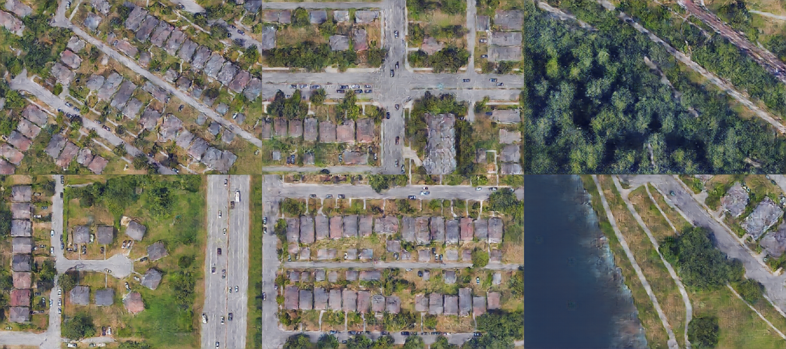
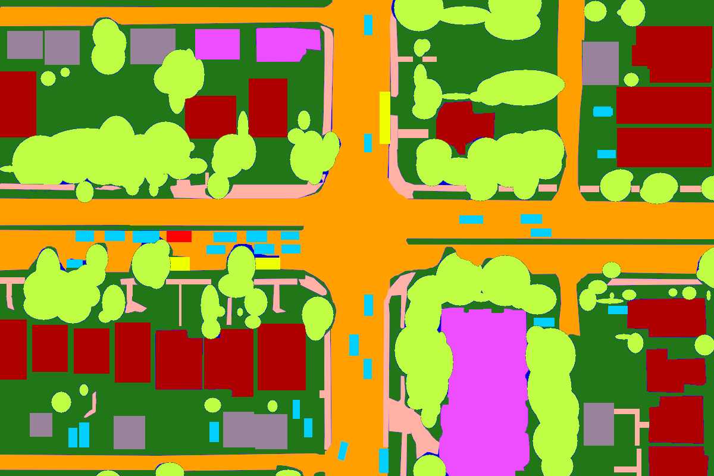
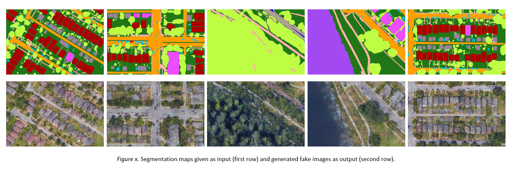

<h1>Sketch 2 Map</h1>

<h2>Idea</h2>

In 2016, Phillip Isola, Jun-Yan Zhu, Tinghui Zhou and Alexei A. Efros came up with a general method for
solving different image generation tasks. Their paper, called <a href="https://phillipi.github.io/pix2pix/">pix2pix</a>,
introduced a pipeline based on Conditional Adversarial Generative Networks (cGANs). Some of the tasks solved by them 
are: generating a street scene based on labels, generating facades of buildings based on colorful sketches and 
generating maps based on satellite images. The latter tasks inspired me to create Sketch2Map: generating satellite
images based on simple colorful sketches.

I have used the same architecture as the authors of pix2pix propose: two deep neural networks that play the adversarial game 
proposed by Goodfellow in 2014. The first model (the Generator) is based on the classic UNet architecture used for
cell segmentation. The second model (the Discriminator) uses a PatchGAN approach for determining whether an image
is real or fake. Both implementations were inspired by the following <a href="https://www.youtube.com/watch?v=SuddDSqGRzg">tutorial</a>.

<h2>Contribution</h2>

My contributions are the following:

<ul>
<li>Created a dataset consisting of semantically segmented satellite-view elements (houses, trees, roads, etc)</li>
<li>Generated realistic satellite images</li>
</ul>

That is it. Unfortunately, it is quite difficult to compare my work to other methods for generating satellite imagery
since image generation is a task that is mostly meant to trick humans into believing the images are real, not for machines
to distinguish them.

<h2>Animations</h2>

By creating similar frames and feeding them one after the other to the model, an animation can be created. The 
following animation consists of 61 frames of hand-drawn sketches:

Below you may see the structure of one of these input frames: (dataset details below)

<h2>The Dataset</h2>

The dataset consists of 125 semantically segmented images of Google Earth images. The pictures were taken around
 Vancouver, Canada (residential, downtown areas) with a zoom of precisely 141 feet (~43 meters). Each image is of size 
 1200x800.

The data is not publicly available. For access to the data, email me at ar_alexandrescu@yahoo.com stating the purpose of
using my data.

In the following table, all classes considered for the segmentation are listed together with their color code 
(in hexadecimal) from the mask.

<table>
    <tr>
        <th>Class</th>
        <th>Color (hex)</th>
    </tr>
    <tr><td>Background</td><td>#0000de</td></tr>
    <tr><td>Car</td><td>#01cfff</td></tr>
    <tr><td>Bus</td><td>#eeff00</td></tr>
    <tr><td>Van</td><td>#fd0002</td></tr>
    <tr><td>Truck</td><td>#654321</td></tr>
    <tr><td>Train</td><td>#808040</td></tr>
    <tr><td>House (residential home)</td><td>#ae0001</td></tr>
    <tr><td>Commercial building</td><td>#ed4dff</td></tr>
    <tr><td>Garage</td><td>#98839a</td></tr>
    <tr><td>Road</td><td>#ff9f00</td></tr>
    <tr><td>Train track</td><td>#aea190</td></tr>
    <tr><td>Sidewalk/Pathway</td><td>#ffb1a6</td></tr>
    <tr><td>Foliage (trees, bushes)</td><td>#bffd45</td></tr>
    <tr><td>Grass</td><td>#217717</td></tr>
    <tr><td>Water</td><td>#a349f1</td></tr>
</table>

<h2>Results</h2>

Training with 120 images (5 validation images) required around 400 epochs in order to generate "satisfying" images.

